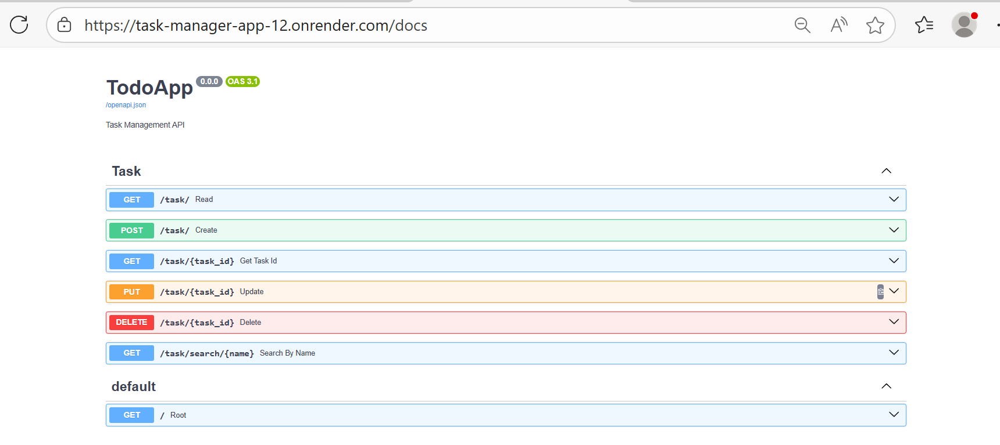

# 🚀 **TodoApp — Task Manager API** - *En*

**TodoApp** is a modern REST API built with **FastAPI**, **SQLAlchemy**, and **Pydantic**, designed to be clean, scalable, and easy to deploy on platforms like **Render**.  
It follows best practices in architecture, API versioning, logging, and environment‑based configuration, making it ideal for learning, extending, or showcasing backend development skills.



---
  ## 📑 Index - *En*
- [🚀 **TodoApp — Task Manager API** - *En*](#-todoapp--task-manager-api---en)
  - [🧩 **Key Features**](#-key-features)
  - [🛠️ **Tech Stack**](#️-tech-stack)
  - [📂 **Project Structure**](#-project-structure)
  - [🔧 **Environment Variables**](#-environment-variables)
  - [⚙️ **Local Installation \& Development**](#️-local-installation--development)
    - [**Requirements**](#requirements)
    - [**Install dependencies**](#install-dependencies)
    - [**Run in development mode**](#run-in-development-mode)
    - [**Interactive API documentation**](#interactive-api-documentation)
  - [🐳 **Run with Docker**](#-run-with-docker)
    - [Build the image](#build-the-image)
    - [Run the container](#run-the-container)
  - [☁️ **Deploying on Render**](#️-deploying-on-render)
  - [🧪 **Testing**](#-testing)
  - [🤝 **Contributing**](#-contributing)
  - [📜 **License**](#-license)
  - [📬 **Contact**](#-contact)


---

## 🧩 **Key Features**

- Full CRUD operations for tasks (create, read, update, delete).
- Search tasks by name.
- API versioning (`v1`, `v2`, `v3`) for compatibility and evolution.
- SQLAlchemy ORM models + Pydantic schemas.
- Configurable logging with file rotation.
- Dockerfile optimized for production (Render‑ready).
- `.env` configuration and Poetry dependency management.
- Clean, modular, scalable project structure.

---

## 🛠️ **Tech Stack**

| Category | Technologies |
|----------|-------------|
| Backend | FastAPI, SQLAlchemy, Pydantic |
| Infrastructure | Docker, Render |
| Configuration | pydantic-settings, `.env` |
| Dependency Management | Poetry |
| Runtime | Python 3.12 |
| Server | Uvicorn |

---

## 📂 **Project Structure**

```
todo_app/
├── app/
│   ├── main.py               # FastAPI entrypoint
│   ├── settings.py           # App configuration (pydantic-settings)
│   ├── api/                  # Versioned routes
│   │   ├── v1/
│   │   ├── v2/
│   │   └── v3/
│   ├── crud/                 # Data access logic
│   ├── models/               # ORM models
│   ├── schemas/              # Pydantic schemas
│   ├── utils/                # Logging, exceptions, helpers
│   └── database.py           # SQLAlchemy engine & session
├── logs/
│   └── app.log               # Rotating log file
├── Dockerfile                # Production-ready container
├── .dockerignore             # Clean build context
├── pyproject.toml            # Poetry dependencies
├── requirements.txt
└── README.md
```

---

## 🔧 **Environment Variables**

| Variable | Description | Default |
|---------|-------------|---------|
| `APP_NAME` | Application name | `TodoApp` |
| `VERSION` | Release version | `0.2.0` |
| `DATABASE_URL` | Database connection string | `sqlite:///./todo_app.db` |
| `LOG_DIR` | Log directory | `logs` |
| `LOG_FILE` | Log filename | `app.log` |
| `LOG_LEVEL` | Logging level | `INFO` |
| `PORT` | Runtime port | Injected by Render |

---

## ⚙️ **Local Installation & Development**

### **Requirements**
- Python 3.12
- Poetry (recommended)

### **Install dependencies**
```bash
poetry install
```

### **Run in development mode**
```bash
uvicorn app.main:app --reload --port 8000
```

### **Interactive API documentation**
- http://localhost:8000/docs  
- http://localhost:8000/redoc  

---

## 🐳 **Run with Docker**

### Build the image
```bash
docker build -t todoapp:local .
```

### Run the container
```bash
docker run --rm -e PORT=8000 -p 8000:8000 todoapp:local
```

---

## ☁️ **Deploying on Render**

1. Create a new **Web Service** on Render.
2. Connect your GitHub repository.
3. Choose **Dockerfile** deployment.
4. Add environment variables under **Settings → Environment**.
5. Render automatically injects `PORT`; the Dockerfile uses it to start Uvicorn.

---

## 🧪 **Testing**

Tests are not included yet.  
Recommended additions:

- `tests/` directory
- `pytest` for:
  - unit tests (CRUD, schemas)
  - integration tests (main endpoints)

---

## 🤝 **Contributing**

1. Fork the repository.
2. Create a feature branch:
   ```bash
   git checkout -b feature/new-feature
   ```
3. Submit a Pull Request with a clear description.
4. Update `CHANGELOG.md` when appropriate.

---

## 📜 **License**

This project is licensed under the **MIT License**.

---

## 📬 **Contact**

**Author:** Ale.CA  
**Email:** aleca0666co@email.com  

---

If you'd like, I can also prepare:

- A version with badges (Python version, Docker, License, Build)  
- A version with diagrams or architecture illustrations  
- A GitHub‑optimized README with collapsible sections  

Just tell me and I’ll shape it exactly how you want.


---

# 🚀 **TodoApp — Task Manager API** - *Es*

**TodoApp** es una API REST moderna construida con **FastAPI**, **SQLAlchemy** y **Pydantic**, diseñada para ser clara, escalable y fácil de desplegar en plataformas como **Render**.  
Incluye buenas prácticas de arquitectura, versionado de API, logging configurable y un flujo de desarrollo pensado para equipos y contribuciones.

---

  ## 📑 Índice - *Es*
  - [🚀 **TodoApp — Task Manager API** ](#-todoapp--task-manager-api---es)
  -  [🧩 **Características principales**](#-características-principales)
  - [🛠️ **Tecnologías utilizadas**](#️-tecnologías-utilizadas)
  - [📂 **Estructura del proyecto**](#-estructura-del-proyecto)
  - [🔧 **Variables de entorno**](#-variables-de-entorno)
  - [⚙️ **Instalación y ejecución local**](#️-instalación-y-ejecución-local)
    - [**Requisitos**](#requisitos)
    - [**Instalar dependencias**](#instalar-dependencias)
    - [**Ejecutar en modo desarrollo**](#ejecutar-en-modo-desarrollo)
    - [**Documentación automática**](#documentación-automática)
  - [🐳 **Ejecución con Docker**](#-ejecución-con-docker)
    - [Construir imagen](#construir-imagen)
    - [Ejecutar contenedor](#ejecutar-contenedor)
  - [☁️ **Despliegue en Render (guía rápida)**](#️-despliegue-en-render-guía-rápida)
  - [🧪 **Testing**](#-testing-1)
  - [🤝 **Contribuir**](#-contribuir)
  - [📜 **Licencia**](#-licencia)
  - [📬 **Contacto**](#-contacto)

---

## 🧩 **Características principales**

- CRUD completo para tareas (crear, leer, actualizar, borrar).
- Búsqueda de tareas por nombre.
- Versionado de API: `v1`, `v2`, `v3` (ideal para evolución y compatibilidad).
- Modelos ORM con SQLAlchemy + Pydantic.
- Logging configurable con rotación de archivos.
- Dockerfile optimizado para producción en PaaS (Render).
- Configuración mediante `.env` y gestión de dependencias con Poetry.
- Estructura modular y mantenible.

---

## 🛠️ **Tecnologías utilizadas**

| Categoría | Tecnologías |
|----------|-------------|
| Backend | FastAPI, SQLAlchemy, Pydantic |
| Infraestructura | Docker, Render |
| Configuración | pydantic-settings, `.env` |
| Dependencias | Poetry |
| Runtime | Python 3.12 |
| Servidor | Uvicorn |

---

## 📂 **Estructura del proyecto**

```
todo_app/
├── app/
│   ├── main.py               # Punto de entrada FastAPI
│   ├── settings.py           # Configuración vía pydantic-settings
│   ├── api/                  # Rutas versionadas
│   │   ├── v1/
│   │   ├── v2/
│   │   └── v3/
│   ├── crud/                 # Lógica de acceso a datos
│   ├── models/               # Modelos ORM
│   ├── schemas/              # Schemas Pydantic
│   ├── utils/                # Logging, excepciones, helpers
│   └── database.py           # Sesión y motor SQLAlchemy
├── logs/
│   └── app.log               # Log con rotación
├── Dockerfile                # Imagen optimizada para Render
├── .dockerignore             # Exclusiones para build limpio
├── pyproject.toml            # Dependencias (Poetry)
├── requirements.txt
└── README.md
```

---

## 🔧 **Variables de entorno**

| Variable | Descripción | Valor por defecto |
|---------|-------------|-------------------|
| `APP_NAME` | Nombre de la aplicación | `TodoApp` |
| `VERSION` | Versión del release | `0.2.0` |
| `DATABASE_URL` | URL de la base de datos | `sqlite:///./todo_app.db` |
| `LOG_DIR` | Carpeta de logs | `logs` |
| `LOG_FILE` | Archivo de log | `app.log` |
| `LOG_LEVEL` | Nivel de logs | `INFO` |
| `PORT` | Puerto de ejecución | Render lo inyecta |

---

## ⚙️ **Instalación y ejecución local**

### **Requisitos**
- Python 3.12
- Poetry (opcional pero recomendado)

### **Instalar dependencias**
```bash
poetry install
```

### **Ejecutar en modo desarrollo**
```bash
uvicorn app.main:app --reload --port 8000
```

### **Documentación automática**
- http://localhost:8000/docs  
- http://localhost:8000/redoc  

---

## 🐳 **Ejecución con Docker**

### Construir imagen
```bash
docker build -t todoapp:local .
```

### Ejecutar contenedor
```bash
docker run --rm -e PORT=8000 -p 8000:8000 todoapp:local
```

---

## ☁️ **Despliegue en Render (guía rápida)**

1. Crear un nuevo **Web Service** en Render.
2. Conectar el repositorio.
3. Seleccionar despliegue por **Dockerfile**.
4. Configurar variables sensibles en **Settings → Environment**.
5. Render inyecta automáticamente `PORT`; el Dockerfile lo usa para iniciar Uvicorn.

---

## 🧪 **Testing**

Actualmente no hay tests incluidos.  
Recomendación:

- Crear carpeta `tests/`
- Usar `pytest` para:
  - pruebas unitarias de `crud` y `schemas`
  - pruebas de integración para endpoints principales

---

## 🤝 **Contribuir**

1. Haz un **fork** del repositorio.
2. Crea una rama feature:
   ```bash
   git checkout -b feature/nueva-funcionalidad
   ```
3. Envía un **Pull Request** con descripción clara.
4. Actualiza el `CHANGELOG.md` si corresponde.

---

## 📜 **Licencia**

Este proyecto está bajo licencia **MIT**.

---

## 📬 **Contacto**

**Autor:** Ale.CA  
**Email:** aleca0666co@email.com  
